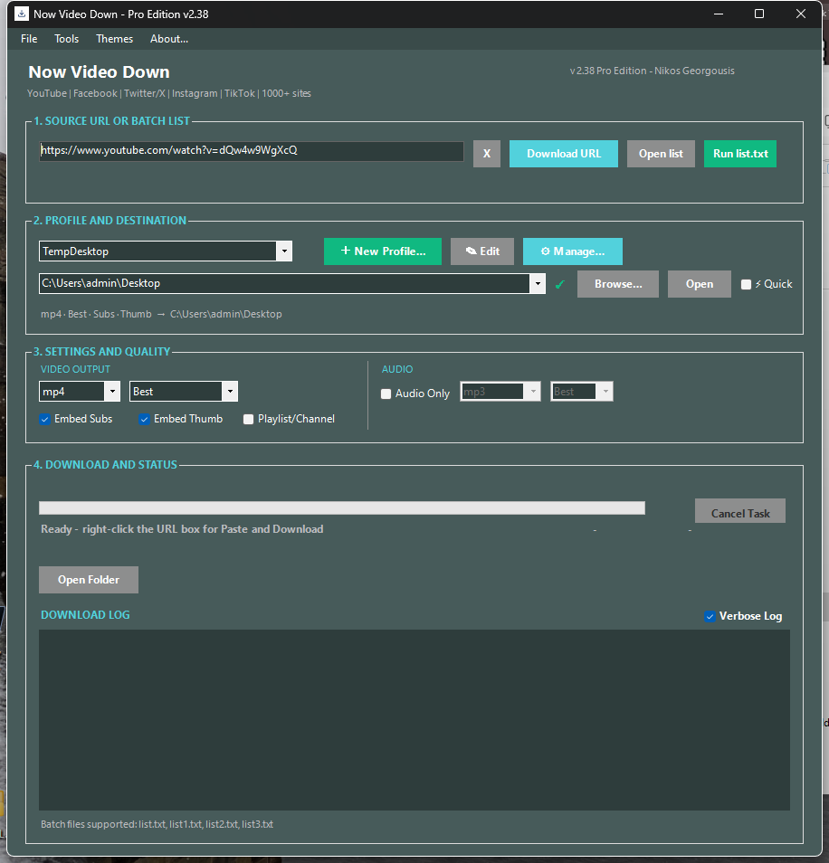
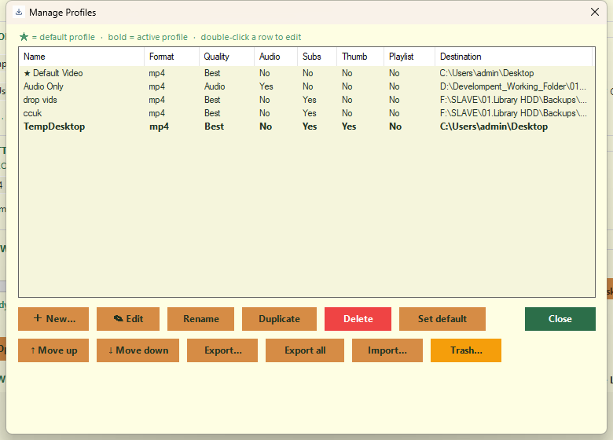
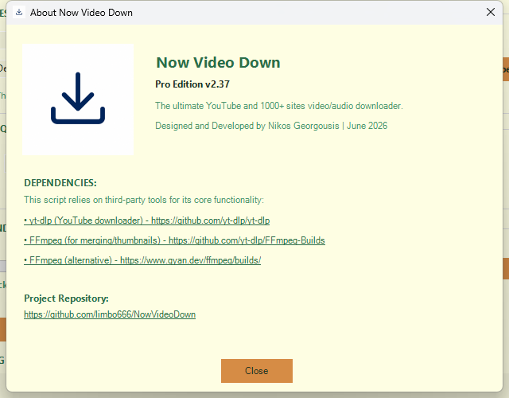
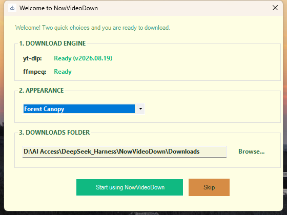

# NowVideoDown

A small desktop app that downloads videos and audio from YouTube and more than a thousand other sites.
Paste a link, choose where to save it, click Download. That's the whole idea.

It wraps [yt-dlp](https://github.com/yt-dlp/yt-dlp) and [ffmpeg](https://ffmpeg.org/) in a proper window,
so you never have to touch the command line.

**Current version: 2.42**

## Why you'll like it

- One window for everything: paste a link, pick format and quality, click Download
- Batch downloads from a plain text file, one URL per line
- Audio-only extraction to mp3, m4a, opus, flac or wav, with bitrate control
- Profiles: save a set of options (format, quality, destination folder) and switch with one click
- Per-profile login: use the cookies of a browser you are already signed into (Brave, Chrome, Edge, Firefox)
  or a cookies.txt file - for X/Twitter, age-restricted or members-only videos
- Subtitle and thumbnail embedding, playlist support
- Sits in the tray while you work; a small popup tells you when a download finishes -
  success and failure popups look different and show actions that actually make sense
- Ten color themes, dark and light - pick one from the first-run wizard and watch it preview live
- Portable: no installer, no account, no registry entries - the whole app is one folder

## Screenshots









## Getting started

1. Download the folder (or the zip from Releases) and put it anywhere you like - Desktop, a USB stick, wherever.
2. Double-click `launch.bat`.
3. Paste a video link into the box and press Enter, or click **Download URL**.

The app needs two helper programs: `yt-dlp.exe` and `ffmpeg.exe`. Neither is shipped in the repository -
they are separate projects with their own licenses, and the app downloads them for you with one click:
start the app, open **Tools** and choose *Download / Update yt-dlp* (and *ffmpeg* if you want subtitles,
thumbnails, or high-quality merging). The window still opens without them, it just disables what needs them.

## A few things worth knowing

- **Right-click the URL box** for *Paste* or *Paste and Download* in one step.
- **Copy a video link anywhere** - clipboard watch (on by default) shows the link in the source row
  with a Download button, so you don't even need to paste it yourself.
- **Play Latest** appears after a successful download and opens the file in your media player.
- **Keyboard shortcuts:** `Ctrl+L` focus the URL box, `Ctrl+Enter` download, `Ctrl+O` open the list file,
  `Ctrl+R` run the list, `Ctrl+N` new profile, `Ctrl+E` edit the profile.
- **Minimize** sends the app to the tray next to the clock. Double-click the tray icon to bring it back.
  Downloads keep running in the background.
- **Completion popups** fade in the corner of the screen. Success popups auto-close and offer **Open folder**;
  failure popups stay until you act and offer **Retry** (for a single failed link), **View log** and **Show window** -
  never a misleading "Open folder" when nothing was saved. Every popup has an ✕ that fades it away.
- **Starting up** shows a small splash so it never looks frozen while the window is being built.
- **Keeps itself current:** on startup the app quietly checks whether a newer yt-dlp exists and offers a
  one-click update if so. First launch shows a short welcome window to pick a theme and downloads folder.
- **Quick mode** (the checkbox in the profile section): change settings for one download only,
  without touching your saved profiles.

## Downloads

Everything is saved to the `Downloads` folder next to the script by default. Each profile can point
at its own folder instead - set it in the profile editor, or right there in the profile row.

## Batch downloads

`list.txt` holds one URL per line. Click **Open list** to edit it, then **Run list.txt** to process them
one after another. You can also use `list1.txt`, `list2.txt` or `list3.txt` as separate lists.

## Profiles

A profile bundles a destination folder with all output settings. The main window shows a one-line
summary of the active profile, so you always know what you are about to get. **Manage Profiles** lets you
create, rename, duplicate, delete (with a trash to restore from), reorder, and export or import profiles as JSON.

### Logging in for restricted videos

Some sites (X/Twitter, age-restricted or members-only content) refuse to download until the app proves
you are signed in. In the profile editor, **LOGIN & COOKIES** gives you two ways:

- **Use login from** - pick the browser where you are already signed in (Brave, Chrome, Edge or Firefox).
  yt-dlp reads that browser's cookies on download. Close the browser first: yt-dlp cannot read the
  cookies of a running browser (a known yt-dlp limitation on Windows).
- **cookies.txt path** - paste the path of a cookies.txt file exported from the browser (an extension
  such as "Get cookies.txt LOCALLY" does this). This also works while the browser is open, and takes
  priority over the browser option when both are set.

The summary line shows *Login: Brave* (or *Login: cookies.txt*) so you always know which profile is authenticated.

## Audio

Enable **Audio Only** to extract the sound track. Pick the format (mp3, m4a, opus, flac, wav) and the
bitrate (Best, 128, 192, 320 kbps). Best keeps the original quality.

## Themes

The **Themes** menu in the menu bar has ten presets. The window's title bar follows the theme,
so dark themes get a dark title bar. On first launch the welcome wizard lets you try themes live -
the whole window recolors as you scroll the list, so you choose from what you see, not a name.

## Requirements

- Windows 10 or 11 with Windows PowerShell 5.1 and .NET Framework 4.7.2 or newer
  (both are included with Windows by default)
- `yt-dlp.exe` and `ffmpeg.exe` - fetched from the app's **Tools** menu (not included in this repository)
- No administrator rights needed

## What's in the folder

```
NowVideoDown/
├─ NowVideoDown.ps1   the app itself
├─ launch.bat         double-click this to start
├─ settings.json      your settings and profiles (created on first run)
├─ log.txt            session log (created while running)
├─ list.txt           batch list, one URL per line (created on first use)
├─ yt-dlp.exe         the download engine (downloaded via Tools menu)
├─ ffmpeg.exe         merging, subtitles, thumbnails (downloaded via Tools menu)
└─ Downloads/         downloaded files (default location)
```

All settings live in the single `settings.json` next to the script - there is no hidden copy
in `%APPDATA%` anymore. Very old installs that still have an `%APPDATA%\VideoDownloader\settings.json`
leftover are imported once and the old file is retired automatically.

## Troubleshooting

- **The app won't start and Windows shows an error about 0xc0000142:** the .NET Framework is missing or
  disabled on that machine. Install .NET Framework 4.8 and try again.
- **Download is greyed out:** `yt-dlp.exe` is missing. Use **Tools → Download / Update yt-dlp**.
- **Subtitles or thumbnails are greyed out:** `ffmpeg.exe` is missing. Use **Tools → Download / Update ffmpeg**.
- **The window vanished:** check the tray, near the clock (the small arrow opens hidden icons).
  The app minimizes to the tray and keeps running.
- **X/Twitter or age-restricted video fails while the browser plays it:** the site needs proof you are
  signed in. Open the profile editor → **LOGIN & COOKIES**, pick the browser where you are logged in
  (close it first) or point at a cookies.txt file, then try again.
- **Delete `settings.json` to start fresh:** the first-run wizard reappears.

## Built on

- [yt-dlp](https://github.com/yt-dlp/yt-dlp) - the download engine
- [FFmpeg](https://ffmpeg.org/) - audio/video processing

## License

NowVideoDown is released under the [MIT License](LICENSE).
yt-dlp and ffmpeg are separate projects and have their own licenses.

Made by Nikos Georgousis.
